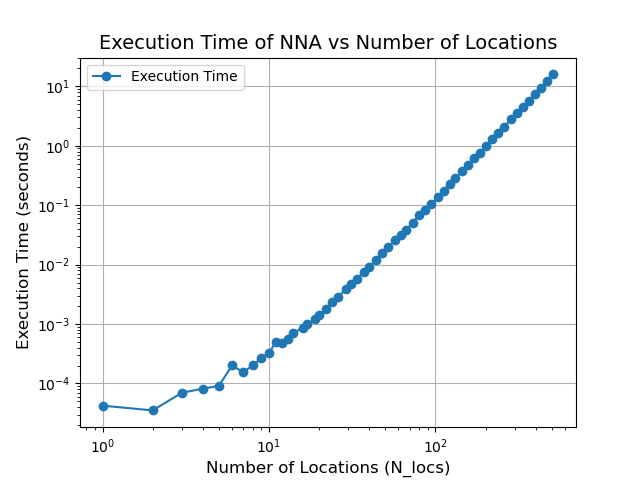

<!-- This is a comment block in Markdown. When the document is rendered, you won't see this text.

If you need help on MarkDown syntax, you can look at the guide here: https://www.markdownguide.org/basic-syntax/.
You are also welcome to ask the Module instructors for help with writing MarkDown.

You can use this template as the starting point for your report.
Answer the questions by writing your answers in the space between the bullet points.
If you are editing this file in VSCode, you can press CTRL+K then V to open a preview of the document.

Comment blocks end by closing the "arrow" we opened at the start. -->

# Determining Depot Locations: Report

<!-- This module is anonymously marked - please DO NOT include your name! -->
Candidate Number: 23035334

<!-- The headers that follow correspond to all questions in the assignment that require a written answer. 

You can write as much as you like for your answers in the space provided.
However please bear in mind that a good answer and a long answer are not necessarily the same thing! -->

## `Location` equality

1. Why might the definition of "equal" not be desirable, if we did not have the assurance from CLtd at the start of this task?

Without the CLtd guarantee, defining equality based only on the property of Location can lead to some errors of judgment. Because floating-point arithmetic is imprecise, even two locations that are actually the same may be judged to be unequal. For example, the ideal distance is 500.0, but the real data might be 500.0000001 or 49.99999999. Because the quality of real data varies, even virtually identical locations may be judged unequal without CLtd's assurance when the data is unreliable.

2. Are there any problems you foresee with this definition of "equal", even with the assurance (at the start of this task) from CLtd?

Even though CLtd guarantees the reliability of the data, the problem still exists due to the accuracy of floating-point arithmetic. For example, CLtd provides data of 500.0, but the program may change the value to 500.000001 during storage and calculation, resulting in miscalculation. In addition, requiring exactly the same equality can cause some problems, such as the location name in the data is "Riverwood", the user may accidentally add a space input as "Riverwood", and the program will misjudge the situation as being unequal.

3. Suggest an idea for avoiding / resolving the problem you raised in point 2, if you identified any. Choose one of your choice if you identified multiple issues. **Do not** implement this idea in your code, however.

To solve this problem, you can refer to "fault tolerant range" when comparing numeric values. When two numerical differences are less than some value, they are equal.

## Fastest Trip From a Given `Location`

1. Is it possible, even after the tie-breakers given in the assignment task, for there to still be multiple entries in `potential_locations` to choose as the closest? (Yes/ No)

No. 

2. If not, why not? If so, what are the circumstances under which this could happen?

The "tie-breakers" determines the only site by eliminating candidates in the following steps. 
First, choose the candidate location with the shortest travel time. Travel times are values that can be accurately compared; 
Second, select the first place in alphabetical order among multiple places with equal travel time; 
Third, if the travel time and name are the same, the first one is further selected according to the alphabetical order of the region names. 
Therefore, the design is strict enough to ensure that you do not return to multiple locations.

3. How can you edit the method to fix the problem (if there is one) without forcing an error to be thrown? (Do not forget, you should implement these fixes in your code if you identify any here).

To increase robustness, the following improvements can be made:
First, use set to remove duplicate values for potential_locations.
Second, use discard to check and remove the current location.
Third, if the destination is empty, return (None, None)

## Execution Time for the NNA

1. Identify (at least) one aspect of the `regular_n_gon` that makes it difficult to understand, or that might make it difficult to understand in the future. Suggest how this might be addressed.

Question1: The 'regular_n_gon' function returns a Country object, rather than an intuitive collection of points, which can be difficult to understand.
Suggest: Add a more detailed explanation and description of the returned values in the comments.

Question2: The name generation of settlements is complicated and not intuitive. Using multiple nested naming conventions can be confusing to anyone looking at the code.
Suggest: Encapsulate the name generation logic as a separate function to increase the readability of the code.

2. Assess the advantages and disadvantages of using `Country`s like those generated from `regular_n_gon` for gathering the execution times $t_{\text{exe}}$, as opposed to a `Country` like the one in `locations.csv` or a `Country` with randomly-distributed settlements. You should give at least one advantage or one disadvantage.

Advantages: Objects generated by regular_n_gon are evenly distributed in the polar coordinates of the circle, which helps to eliminate the problem of uneven distribution that may be caused by random distribution and makes the calculation time more stable.
Disadvantages: Such evenly distributed data may not truly represent the distribution characteristics of real-world locations.

3. Comment on the relationship between the execution time $t_{\text{exe}}$ and number of settlements $N_{\text{locs}}$, given the data in your plot. You should include your plot as an image here.

The execution time $t_{\text{exe}}$ is positively correlated with the number of positions $N_{\text{locs}}$. There is a quadratic relationship but no linear correlation. In $N_{\text{locs}}$ comparison hours (less than 10), the growth is relatively slow; When the value of $N_{\text{locs}}$ is large (approximately greater than 10), the growth rate accelerates and the growth curve becomes steeper.

4. Why do you think $t_{\text{exe}}$ and $N_{\text{locs}}$ have this kind of relationship?

This is due to the working principle and complexity of the NNA algorithm. For each iteration, the NNA needs to calculate the distance from the current point to other unvisited points, the number of calculations should be $O(N_{\text{locs}}^2)$. If we want to improve the calculation time, we can reduce the complexity by improving the distance search and region statistics. For example, KD-tree is used to improve distance search, and hash table is constructed to predict the number of statistics. Using KD-tree speeds up the search for the nearest point, reducing the complexity of single query from $O(N_{\text{locs}})$ to $O(\log N_{\text{locs}})$, and reducing the overall complexity to $O(N_{\text{locs}} \log N_{\text{locs}})$.
